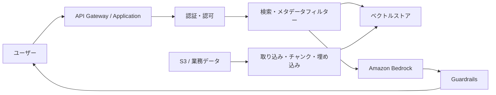
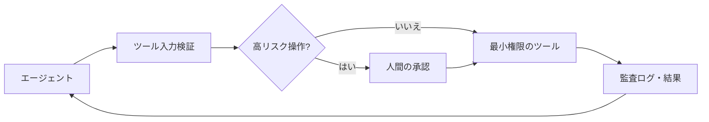

# 14. アーキテクチャ図集

## RAG アプリケーション

```mermaid
flowchart LR
  U[ユーザー] --> API[API Gateway / Application]
  API --> AUTH[認証・認可]
  AUTH --> RET[検索・メタデータフィルター]
  RET --> VS[ベクトルストア]
  RET --> FM[Amazon Bedrock]
  FM --> GR[Guardrails]
  GR --> U
  DOC[S3 / 業務データ] --> ING[取り込み・チャンク・埋め込み]
  ING --> VS
```

## 承認付きエージェント

```mermaid
flowchart LR
  A[エージェント] --> V[ツール入力検証]
  V --> P{高リスク操作?}
  P -- はい --> H[人間の承認]
  P -- いいえ --> T[最小権限のツール]
  H --> T
  T --> O[監査ログ・結果]
  O --> A
```
