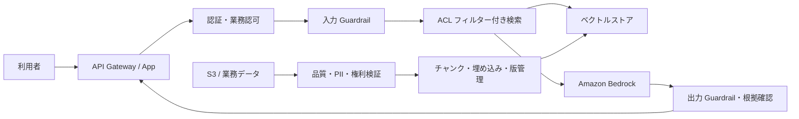
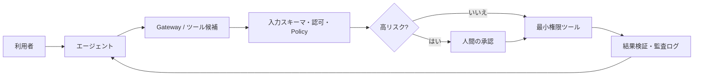
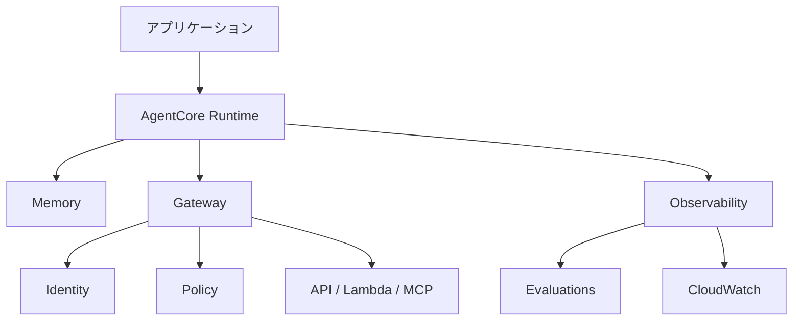
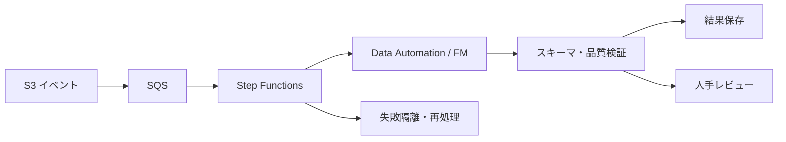

# 14. アーキテクチャ図集

図では、モデルの前後にある認可・検証と、オンライン経路から分離された取り込み経路に注目してください。

## 認可付き RAG

重要点は、テナント ACL を FM ではなく検索前に強制することです。Guardrail と業務認可は別の責務です。

## 承認付きエージェント

最大ステップ、時間、トークン、費用の予算はエージェントループの外側から強制します。

## AgentCore を使う本番エージェント

AgentCore の各機能は独立して利用できます。Runtime を使えば認可や評価が自動的に完成するわけではありません。

## 非同期データ処理

ジョブと項目ごとの状態、冪等性、部分再処理が長時間ワークフローの要点です。
